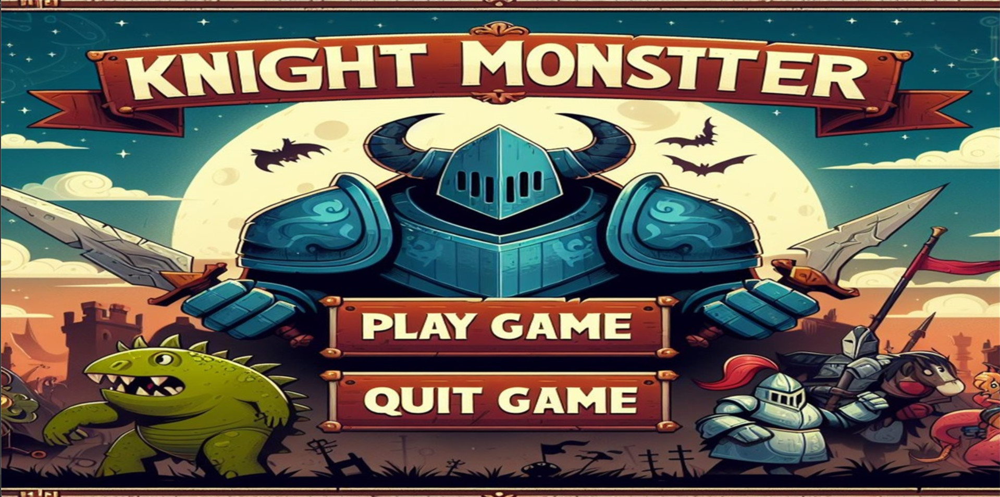
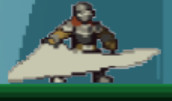
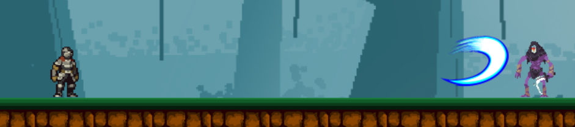
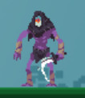
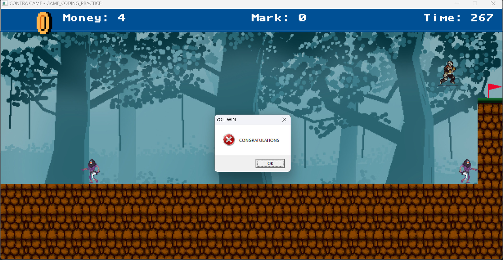
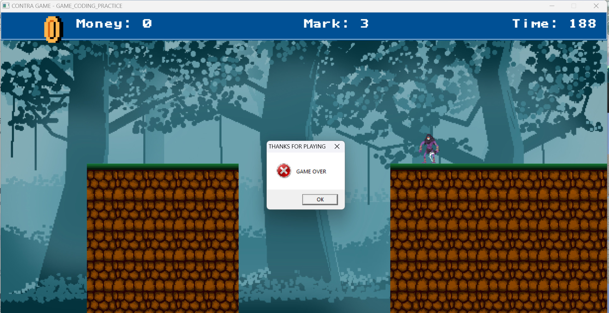

# KNIGHT x MONSTERS
    Họ và tên : Lê Duy Khánh Toàn – K68J - UET
    Mã sinh viên : 23020702
    Bài tập lớn : KNIGHTS x MONSTERS (Lập trình nâng cao)
_________________
## GIỚI THIỆU GAME
KNIGHT x MONSTERS là một trò chơi nhập vai độc đáo và thú vị, nơi bạn sẽ bước vào một cuộc phiêu lưu đầy hấp dẫn và thử thách. Trong trò chơi, nhiệm vụ của bạn là tiêu diệt hết tất cả những con quái vật nguy hiểm và bảo vệ an nguy cho người dân.

_________________
## ĐIỂM NỔI BẬT
- Cơ chế đơn giản nhưng không kém phần thú vị: Bạn phải hết sức khéo léo né quái vật và tiêu diệt chúng, đồng thời kiếm các đồng vàng để sử dụng khả năng đặc biệt.
- Đồ Họa Tuyệt Vời: Trải nghiệm trò chơi với đồ họa đẹp mắt và hấp dẫn, cùng với âm nhạc sống động và hiệu ứng âm thanh sinh động.

_______
[Bắt đầu game](#bắt-đầu-game)
[Cách chơi](#Cách-chơi)
[Kết thúc](#Kết-thúc)

__________________
### 1 . Bắt đầu Game

Mở file exe để chơi game
Màn hình sẽ hiện ra

Click chuột vào ô [Play game] để có thể bắt đầu vào chơi game hoặc click chuột vào ô [Quit game] để thoát

__________________
### 2 . Cách chơi
Bắt đầu từ màn hình chính, chọn "Play game" để bắt đầu cuộc phiêu lưu.
Nếu muốn thoát game, hãy chọn "Quit game" để thoát.
Tiêu diệt hết các quái vật và trở thành người chơi xuất sắc nhất!
Cơ Chế Điều Khiển:
- Sử dụng các phím mũi tên trái, phải để di chuyển.
- Sử dụng phím cách để nhảy.
- Sử dụng phím z để thực hiện tấn công thường.
  
- Mỗi khi bạn kiếm được vàng, hãy tiêu 2 vàng để sử dụng nút x để phát động skill chém đặc biệt.
  
- Khi bạn tiêu diệt hết quái vật và chạm được vào đích, bạn sẽ chiến thắng.
- Hãy cẩn thận với lũ quái và vực sâu, bạn sẽ thua nếu đụng phải chúng.
  

__________

### 3 . Kết thúc
>Người chơi dành chiến thắng khi chạm vạch đích

>Người chơi thua cuộc khi rơi xuống vực thẳm hoặc chạm phải kẻ địch

>Sau khi hoàn thành trò chơi chương trình sẽ tự động đóng

**KNIGHTS x MONSTERS không chỉ là một trò chơi giải trí, mà còn là một cuộc thách thức tuyệt vời cho trí óc của bạn. Hãy chuẩn bị để thử thách bản thân và khám phá những bí ẩn đầy kỳ diệu trong trò chơi này!**

______________

**Đồ hoạ và âm thanh**
Các ảnh đều lấy từ hình ảnh trên [google](google.com) và công cụ hỗ trợ như [Bing AI](bing.com) và một số công cụ khác ….
Âm thanh được tải về từ [youtube](youtube.com) và được chuyển đổi thành các file âm thanh có đuôi phù hợp từ các trang web như : 
-	https://audio.online-convert.com/vi/convert/mp3-sang-wav
-	https://onlineconvertfree.com/vn/convert-format/mp3-to-wav

**Source code game**
- common_function: Chứa các thư viện, các định nghĩa, các struct, class dùng xuyên suốt quá trình làm game.
- base_object: chứa class base_object chứa các hàm, các biến cơ sở để build nhân vật cũng như kẻ địch.
- game_map: Chức năng chính là đọc file chứa thông số map và vẽ map lên trên màn hình.
- player_object: Chứa tất cả các thông số, quy định hành động của nhân vật.
- slash_skill: chứa thông số về skill của nhân vật.
- threats: chứa thông sô và hành động của đối tượng quái vật, bao gồm việc đứng yên và chuyển dộng.
- game_over: chứa các hàm quy định thắng / thua của game.
- text_object: có nhiệm vụ tạo text và vẽ text lên màn hình.
- in_game: có nhiệm vụ vẽ các ảnh và các khối hình phụ lên màn hình.
- menu: Tạo menu và render lên màn hình, cũng như các thao tác với menu game.
- main: File chính, có chứa 1 vài hàm khởi tạo SDL cũng như hàm giải phóng, đồng thời vận hành tất cả các logic chính của game dựa trên các file khác.
- Các file img, font, map, mixer chứa các thông tin về đồ họa, âm thanh, hình ảnh của game.
 
**1 số lỗi**
- Lỗi về quản lí dữ liệu game.
- Game thi thoảng sẽ có hiện tượng giật lag.
- Khi thoát chương trình sẽ bị delay một thời gian.
- DI chuyển của quái chưa được xử lí nhiều.

**Tải game**
- Link GGDrive: https://drive.google.com/file/d/1ADK86ugMjm-qEzaHPAi3g5OzYvAQ3WOZ/view?usp=sharing

**Source code tham khảo**
- Link: https://drive.google.com/file/d/1NV7cdAL27kzAHJ3fIcrwgsgKOeTHsbYD/view

**Video demo game và review code**
- Link: https://drive.google.com/file/d/1PaMaYMQQn1ERbIejXszFtTicNTAkuquD/view?usp=sharing
